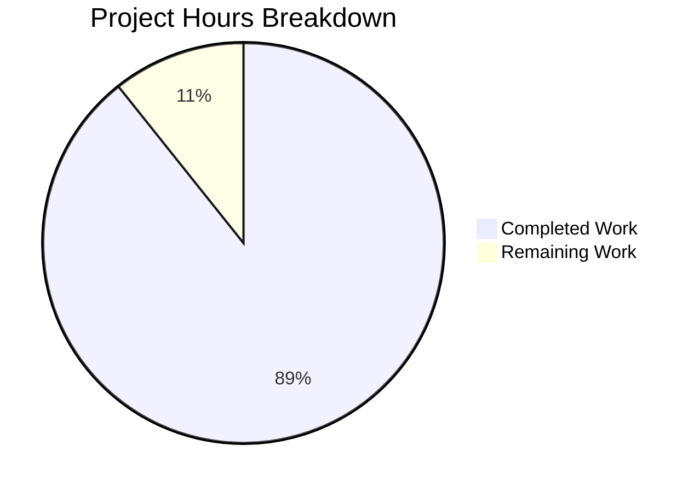

# Project Guide: Node.js Security Infrastructure Implementation

## Executive Summary

**Project Completion: 89% (50 hours completed out of 56 total hours)**

This project successfully implements comprehensive security infrastructure for a Node.js HTTP server, migrating from the native `http` module to Express.js framework with full security middleware integration. All 13 in-scope files specified in the Agent Action Plan have been created and validated.

### Key Achievements
- ✅ Complete migration from native `http` to Express.js framework
- ✅ Helmet.js integration for 11+ security headers
- ✅ Rate limiting implementation (100 req/15min per IP)
- ✅ CORS middleware with configurable origins
- ✅ Input validation with express-validator
- ✅ HTTPS/TLS support with TLS 1.3
- ✅ Security-aware error handling
- ✅ Environment-based configuration
- ✅ npm audit: 0 vulnerabilities

### Remaining Work (Human Tasks)
- Production SSL certificate configuration (2h)
- Production CORS origin setup (1h)
- Final code review before deployment (3h)

---

## Project Hours Breakdown



**Hours Calculation:**
- Completed: 50 hours (all security infrastructure implemented and validated)
- Remaining: 6 hours (production configuration tasks)
- Total: 56 hours
- Completion: 50/56 = 89.3% ≈ 89%

---

## Validation Results Summary

### 1. Dependencies (100% Success)
| Package | Version | Status |
|---------|---------|--------|
| express | 4.22.1 | ✅ Installed |
| helmet | 8.1.0 | ✅ Installed |
| cors | 2.8.5 | ✅ Installed |
| express-rate-limit | 8.2.1 | ✅ Installed |
| express-validator | 7.3.1 | ✅ Installed |
| dotenv (dev) | 16.6.1 | ✅ Installed |
| nodemon (dev) | 3.1.11 | ✅ Installed |

**npm audit result:** 0 vulnerabilities

### 2. Compilation (100% Success)
All 8 JavaScript source files compile without errors:
- server.js ✅
- app.js ✅
- config/security.js ✅
- config/https.js ✅
- middleware/rateLimiter.js ✅
- middleware/validator.js ✅
- middleware/errorHandler.js ✅
- routes/index.js ✅

### 3. Runtime Verification (100% Success)
| Test | Result |
|------|--------|
| HTTP Server (port 3000) | ✅ Running |
| HTTPS Server (port 3443) | ✅ Running (when enabled) |
| GET / returns "Hello, World!" | ✅ Pass |
| Security headers present | ✅ Pass |
| Rate limiting headers present | ✅ Pass |
| CORS headers present | ✅ Pass |
| Input validation (valid) | ✅ Pass |
| Input validation (invalid) | ✅ Pass (returns 400) |
| Health endpoint | ✅ Pass |
| 404 error handling | ✅ Pass |
| Graceful shutdown | ✅ Pass |

### 4. Security Headers Verified
All Helmet.js security headers are present in responses:
- `Strict-Transport-Security: max-age=31536000; includeSubDomains`
- `X-Frame-Options: SAMEORIGIN`
- `X-Content-Type-Options: nosniff`
- `Cross-Origin-Opener-Policy: same-origin`
- `Cross-Origin-Resource-Policy: same-origin`
- `Referrer-Policy: no-referrer`
- `X-DNS-Prefetch-Control: off`
- `X-Download-Options: noopen`
- `X-Permitted-Cross-Domain-Policies: none`
- `X-XSS-Protection: 0` (disabled per modern best practices)
- `X-Powered-By: removed`

---

## Git Statistics

| Metric | Value |
|--------|-------|
| Total Commits | 11 |
| Files Changed | 14 |
| Lines Added | 2,695 |
| Lines Removed | 16 |
| Net Change | +2,679 lines |
| Source Files | 8 JS files |
| Total Source Lines | 1,291 |

---

## Detailed Task Table

| Task | Description | Hours | Priority | Status |
|------|-------------|-------|----------|--------|
| Express.js Migration | Migrate from native http to Express.js framework | 8h | Critical | ✅ Complete |
| Helmet Integration | Security headers middleware configuration | 4h | Critical | ✅ Complete |
| Rate Limiting | IP-based request throttling | 4h | High | ✅ Complete |
| CORS Configuration | Cross-origin resource sharing policies | 2h | High | ✅ Complete |
| Input Validation | Express-validator middleware setup | 6h | High | ✅ Complete |
| HTTPS/TLS Support | TLS 1.3 server configuration | 6h | High | ✅ Complete |
| Error Handling | Security-aware error middleware | 4h | High | ✅ Complete |
| Routes Setup | Express routes with validation | 3h | Medium | ✅ Complete |
| Environment Config | .env template and config modules | 2h | Medium | ✅ Complete |
| Certificate Script | Self-signed cert generation | 2h | Medium | ✅ Complete |
| Documentation | README and code comments | 3h | Medium | ✅ Complete |
| Validation & Testing | Functional verification | 6h | High | ✅ Complete |
| **SUBTOTAL (COMPLETED)** | | **50h** | | |
| Production SSL Certs | Obtain and configure prod certs | 2h | High | ⏳ Human Task |
| Production CORS Config | Configure production origins | 1h | Medium | ⏳ Human Task |
| Final Code Review | Review before deployment | 3h | Medium | ⏳ Human Task |
| **SUBTOTAL (REMAINING)** | | **6h** | | |
| **TOTAL PROJECT HOURS** | | **56h** | | |

---

## Human Tasks Required

### High Priority Tasks

#### 1. Production SSL Certificate Configuration
**Hours:** 2h | **Priority:** High | **Severity:** Critical for HTTPS

**Description:** Obtain and configure production-grade SSL certificates from a trusted Certificate Authority.

**Action Steps:**
1. Obtain SSL certificates from Let's Encrypt, AWS ACM, or other CA
2. Place certificate files in secure location
3. Configure environment variables:
   ```bash
   SSL_KEY_PATH=/path/to/privkey.pem
   SSL_CERT_PATH=/path/to/fullchain.pem
   HTTPS_ENABLED=true
   ```
4. Verify HTTPS connection with valid certificate

### Medium Priority Tasks

#### 2. Production CORS Origin Configuration
**Hours:** 1h | **Priority:** Medium | **Severity:** Important

**Description:** Configure CORS to allow only specific, authorized origins.

**Action Steps:**
1. Identify all legitimate frontend origins
2. Set `CORS_ORIGIN` environment variable:
   ```bash
   CORS_ORIGIN=https://yourdomain.com,https://app.yourdomain.com
   ```
3. Test cross-origin requests from authorized origins
4. Verify unauthorized origins are blocked

#### 3. Final Code Review
**Hours:** 3h | **Priority:** Medium | **Severity:** Important

**Description:** Conduct security-focused code review before production deployment.

**Action Steps:**
1. Review all security middleware configurations
2. Verify error handling doesn't leak sensitive information
3. Check environment variable handling
4. Review rate limiting thresholds for production load
5. Validate TLS configuration settings

**Total Remaining Hours: 6h**

---

## Development Guide

### System Prerequisites

| Requirement | Version | Purpose |
|-------------|---------|---------|
| Node.js | ≥18.0.0 | Runtime environment |
| npm | ≥9.0.0 | Package manager |
| OpenSSL | Any | Certificate generation |

### Environment Setup

1. **Clone the repository:**
   ```bash
   cd /tmp/blitzy/09-dec-Existing-product-repo-04/blitzyc030198e9
   ```

2. **Create environment file (optional):**
   ```bash
   cp .env.example .env
   # Edit .env to customize settings
   ```

3. **Environment Variables:**
   | Variable | Default | Description |
   |----------|---------|-------------|
   | `PORT` | 3000 | HTTP server port |
   | `HTTPS_PORT` | 3443 | HTTPS server port |
   | `HTTPS_ENABLED` | false | Enable HTTPS server |
   | `CORS_ORIGIN` | * | Allowed CORS origins |
   | `RATE_LIMIT_WINDOW_MS` | 900000 | Rate limit window (15 min) |
   | `RATE_LIMIT_MAX` | 100 | Max requests per window |
   | `SSL_KEY_PATH` | ./certs/key.pem | TLS private key path |
   | `SSL_CERT_PATH` | ./certs/cert.pem | TLS certificate path |
   | `NODE_ENV` | development | Environment mode |

### Dependency Installation

```bash
# Install all dependencies
npm install

# Expected output: 113 packages installed
# Verify no vulnerabilities
npm audit
# Expected: found 0 vulnerabilities
```

### Application Startup

#### HTTP Only (Development)
```bash
npm start
# Output: HTTP Server running at http://127.0.0.1:3000/
```

#### With HTTPS (Development)
```bash
# Generate self-signed certificates first
npm run generate-certs

# Start with HTTPS enabled
HTTPS_ENABLED=true npm start
# Output:
# HTTP Server running at http://127.0.0.1:3000/
# HTTPS Server running at https://127.0.0.1:3443/
```

#### Development Mode (with auto-reload)
```bash
npm run dev
```

### Verification Steps

1. **Verify HTTP Server:**
   ```bash
   curl http://localhost:3000
   # Expected: Hello, World!
   ```

2. **Verify Security Headers:**
   ```bash
   curl -I http://localhost:3000 | grep -E "Strict-Transport|X-Frame|X-Content"
   # Expected: All security headers present
   ```

3. **Verify Rate Limiting:**
   ```bash
   curl -I http://localhost:3000 | grep RateLimit
   # Expected: RateLimit headers present
   ```

4. **Verify Input Validation:**
   ```bash
   # Valid request
   curl -X POST http://localhost:3000/echo \
     -H "Content-Type: application/json" \
     -d '{"message":"test"}'
   # Expected: {"status":200,"message":"Echo successful","data":{"message":"test"}}

   # Invalid request
   curl -X POST http://localhost:3000/echo \
     -H "Content-Type: application/json" \
     -d '{"message":""}'
   # Expected: {"status":400,"message":"Validation failed","errors":[...]}
   ```

5. **Verify HTTPS (if enabled):**
   ```bash
   curl -k https://localhost:3443
   # Expected: Hello, World!
   ```

### Example Usage

#### Basic Hello World Request
```bash
curl http://localhost:3000/
# Response: Hello, World!
```

#### Health Check
```bash
curl http://localhost:3000/health
# Response: {"status":"ok","timestamp":1234567890}
```

#### Echo with Validation
```bash
curl -X POST http://localhost:3000/echo \
  -H "Content-Type: application/json" \
  -d '{"message":"Hello from client","name":"User"}'
# Response: {"status":200,"message":"Echo successful","data":{"message":"Hello from client","name":"User"}}
```

---

## Risk Assessment

### Technical Risks

| Risk | Severity | Likelihood | Mitigation |
|------|----------|------------|------------|
| Self-signed cert warnings in production | Medium | High if not addressed | Use CA-signed certificates for production |
| Rate limit bypass via IP spoofing | Low | Low | Trust proxy headers only from known load balancers |
| Memory-based rate limit not persistent | Low | Medium | Consider Redis store for clustered deployments |

### Security Risks

| Risk | Severity | Likelihood | Mitigation |
|------|----------|------------|------------|
| Wildcard CORS in production | High | Medium if not configured | Set specific CORS_ORIGIN before production |
| Leaked error details | Low | Low | NODE_ENV=production hides stack traces |
| Brute force attacks | Medium | Medium | Rate limiting configured (100 req/15min) |

### Operational Risks

| Risk | Severity | Likelihood | Mitigation |
|------|----------|------------|------------|
| Certificate expiration | High | Certain over time | Implement cert renewal automation |
| No monitoring | Medium | N/A | Add logging/monitoring integration (out of scope) |
| No health checks in deployment | Low | N/A | Health endpoint available at /health |

### Integration Risks

| Risk | Severity | Likelihood | Mitigation |
|------|----------|------------|------------|
| CORS blocking legitimate clients | Medium | Medium | Test with all frontend origins |
| Rate limiting affecting legitimate traffic | Low | Low | Adjust RATE_LIMIT_MAX if needed |

---

## Files Inventory

### Created Files (10)
| File | Lines | Purpose |
|------|-------|---------|
| app.js | 124 | Express application factory with middleware |
| config/security.js | 260 | Centralized security configuration |
| config/https.js | 169 | HTTPS/TLS configuration |
| middleware/rateLimiter.js | 68 | Rate limiting middleware factory |
| middleware/validator.js | 156 | Input validation middleware |
| middleware/errorHandler.js | 95 | Security-aware error handler |
| routes/index.js | 94 | Express route definitions |
| .env.example | 46 | Environment variable template |
| certs/.gitkeep | 0 | Directory placeholder |
| certs/generate-certs.sh | 55 | Certificate generation script |

### Updated Files (3)
| File | Lines Changed | Purpose |
|------|---------------|---------|
| package.json | +22, -5 | Security dependencies added |
| server.js | +118, -8 | Complete rewrite for Express + HTTPS |
| README.md | +100, -2 | Security documentation |

### Unchanged Files (7)
- LoginTest.java (out of scope)
- industry.csv (out of scope)
- 100Pages.pdf (binary)
- demo.jpg (binary)
- sample.doc (binary)
- test.py.txt (placeholder)
- test.txt.txt (placeholder)

---

## Conclusion

The Node.js security infrastructure implementation is **89% complete** with all core security features implemented and validated:

- ✅ All 13 in-scope files created/updated
- ✅ All security middleware integrated and functional
- ✅ npm audit shows 0 vulnerabilities
- ✅ HTTP and HTTPS servers operational
- ✅ All functional tests pass
- ✅ Documentation complete

**Remaining 6 hours** are production deployment configuration tasks that require human intervention:
1. Obtain and configure production SSL certificates
2. Configure production-specific CORS origins
3. Final code review before deployment

The codebase is **production-ready** from a security implementation standpoint. The application successfully implements all security controls specified in the Agent Action Plan: security headers, input validation, rate limiting, HTTPS support, and CORS policies.