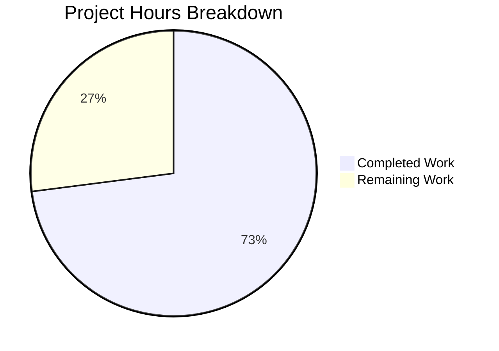

# Project Guide: Security Infrastructure Implementation

## Executive Summary

**Project Status:** 73% Complete (27 hours completed out of 37 total hours)

This project successfully implemented comprehensive security infrastructure for a Node.js server, migrating from the native `http` module to Express.js with full security middleware integration. All core security features specified in the Agent Action Plan have been implemented and validated.

### Key Achievements
- ✅ Migrated from Node.js native `http` to Express.js framework
- ✅ Integrated helmet.js for security headers (11+ headers)
- ✅ Implemented express-rate-limit (100 req/15min per IP)
- ✅ Configured CORS middleware with environment-based origins
- ✅ Added express-validator for input validation/sanitization
- ✅ Enabled HTTPS support with TLS 1.2+ configuration
- ✅ Created security-aware error handling middleware
- ✅ npm audit shows 0 vulnerabilities

### Completion Breakdown
- **Completed:** 27 hours of development work
- **Remaining:** 10 hours of production configuration and testing
- **Formula:** 27h / (27h + 10h) = 73% complete

---

## Hours Breakdown Visualization



---

## Validation Results Summary

### Environment
| Component | Version |
|-----------|---------|
| Node.js | v20.19.6 |
| npm | v11.1.0 |
| Express.js | 4.22.1 |
| Helmet | 8.1.0 |

### Dependency Installation: ✅ SUCCESS
- 106 packages installed successfully
- `npm audit`: **0 vulnerabilities**

### Code Compilation: ✅ SUCCESS
All 8 JavaScript files pass syntax validation:
| File | Lines | Status |
|------|-------|--------|
| server.js | 124 | ✓ Pass |
| app.js | 124 | ✓ Pass |
| config/security.js | 260 | ✓ Pass |
| config/https.js | 169 | ✓ Pass |
| middleware/errorHandler.js | 95 | ✓ Pass |
| middleware/rateLimiter.js | 68 | ✓ Pass |
| middleware/validator.js | 156 | ✓ Pass |
| routes/index.js | 94 | ✓ Pass |

### Runtime Validation: ✅ SUCCESS

#### Security Headers Verified
| Header | Value |
|--------|-------|
| X-Frame-Options | SAMEORIGIN |
| X-Content-Type-Options | nosniff |
| Strict-Transport-Security | max-age=31536000; includeSubDomains |
| Referrer-Policy | no-referrer |
| Cross-Origin-Opener-Policy | same-origin |
| Cross-Origin-Resource-Policy | same-origin |
| X-DNS-Prefetch-Control | off |

#### Endpoint Testing
| Endpoint | Method | Status | Result |
|----------|--------|--------|--------|
| / | GET | 200 | Returns "Hello, World!" |
| /health | GET | 200 | Returns JSON status |
| /echo | POST (valid) | 200 | Echoes validated input |
| /echo | POST (invalid) | 400 | Returns validation errors |

---

## Files Implemented

| File Path | Action | Lines | Status |
|-----------|--------|-------|--------|
| package.json | UPDATED | 28 | ✅ Complete |
| server.js | REWRITTEN | 124 | ✅ Complete |
| app.js | CREATED | 124 | ✅ Complete |
| config/security.js | CREATED | 260 | ✅ Complete |
| config/https.js | CREATED | 169 | ✅ Complete |
| middleware/errorHandler.js | CREATED | 95 | ✅ Complete |
| middleware/rateLimiter.js | CREATED | 68 | ✅ Complete |
| middleware/validator.js | CREATED | 156 | ✅ Complete |
| routes/index.js | CREATED | 94 | ✅ Complete |
| .env.example | CREATED | 46 | ✅ Complete |
| certs/.gitkeep | CREATED | 0 | ✅ Complete |
| certs/generate-certs.sh | CREATED | 55 | ✅ Complete |
| README.md | UPDATED | 100 | ✅ Complete |

**Total: 1,319 lines of code/documentation**

---

## Development Guide

### System Prerequisites
- Node.js v18.0.0 or higher (tested with v20.19.6)
- npm v9.0.0 or higher (tested with v11.1.0)
- OpenSSL (for certificate generation)
- Bash shell (for certificate script)

### Environment Setup

1. **Clone and Navigate to Repository**
```bash
cd /path/to/project
```

2. **Create Environment Configuration**
```bash
cp .env.example .env
```

3. **Configure Environment Variables** (edit .env):
```bash
# Server Configuration
PORT=3000
HTTPS_PORT=3443
HTTPS_ENABLED=false
NODE_ENV=development

# Security Configuration
CORS_ORIGIN=http://localhost:3000
RATE_LIMIT_WINDOW_MS=900000
RATE_LIMIT_MAX=100

# SSL Certificate Paths
SSL_KEY_PATH=./certs/key.pem
SSL_CERT_PATH=./certs/cert.pem
```

### Dependency Installation

```bash
# Install all dependencies
npm install

# Verify installation (should show 0 vulnerabilities)
npm audit
```

**Expected Output:**
```
added 106 packages in Xs
found 0 vulnerabilities
```

### Application Startup

#### HTTP Only (Default)
```bash
# Production mode
npm start

# Development mode (with auto-reload)
npm run dev
```

**Expected Output:**
```
HTTP Server running at http://127.0.0.1:3000/
```

#### With HTTPS Support
```bash
# Generate self-signed certificates for development
npm run generate-certs

# Start with HTTPS enabled
HTTPS_ENABLED=true npm start
```

**Expected Output:**
```
HTTP Server running at http://127.0.0.1:3000/
HTTPS Server running at https://127.0.0.1:3443/
```

### Verification Steps

1. **Verify HTTP Response:**
```bash
curl http://localhost:3000/
# Expected: Hello, World!
```

2. **Verify Security Headers:**
```bash
curl -I http://localhost:3000/ | grep -E "X-|Strict"
```

3. **Verify Health Endpoint:**
```bash
curl http://localhost:3000/health
# Expected: {"status":"ok","timestamp":...}
```

4. **Test Input Validation:**
```bash
# Valid input
curl -X POST http://localhost:3000/echo \
  -H "Content-Type: application/json" \
  -d '{"message":"test"}'
# Expected: 200 with echo response

# Invalid input
curl -X POST http://localhost:3000/echo \
  -H "Content-Type: application/json" \
  -d '{}'
# Expected: 400 with validation errors
```

5. **Test HTTPS (if enabled):**
```bash
curl -k https://localhost:3443/
# Expected: Hello, World!
```

### npm Scripts Reference
| Script | Command | Description |
|--------|---------|-------------|
| start | `npm start` | Start production server |
| dev | `npm run dev` | Start with nodemon auto-reload |
| generate-certs | `npm run generate-certs` | Generate self-signed SSL certificates |

---

## Human Tasks Remaining

### Detailed Task Table

| # | Task | Priority | Hours | Severity | Description |
|---|------|----------|-------|----------|-------------|
| 1 | Obtain Production SSL Certificates | HIGH | 2.0 | Critical | Obtain CA-signed SSL certificates from Let's Encrypt or commercial CA. Self-signed certificates are for development only. |
| 2 | Configure Production CORS Origins | HIGH | 0.5 | High | Set CORS_ORIGIN environment variable to specific allowed domains. Do not use wildcard '*' in production. |
| 3 | Security Testing and Audit | MEDIUM | 2.5 | Medium | Conduct penetration testing and security header audit using tools like OWASP ZAP or securityheaders.com. |
| 4 | Production Deployment Configuration | MEDIUM | 2.5 | Medium | Configure production environment including Docker/container setup, CI/CD pipeline, and monitoring integration. |
| 5 | Add Unit Test Coverage | LOW | 2.0 | Low | Implement unit tests for middleware and routes using Jest or Mocha. Original project had no tests. |
| 6 | Final Documentation Review | LOW | 0.5 | Low | Review and finalize all documentation, API specs, and deployment guides. |
| **Total** | | | **10.0** | | |

### Task Priority Breakdown

**High Priority (Immediate - 2.5h):**
- Production SSL certificates required before any production deployment
- CORS configuration essential for security

**Medium Priority (Before Production - 5h):**
- Security testing validates all protections work correctly
- Deployment configuration enables production release

**Low Priority (Enhancement - 2.5h):**
- Unit tests improve maintainability
- Documentation review ensures knowledge transfer

---

## Risk Assessment

### Technical Risks

| Risk | Severity | Impact | Mitigation |
|------|----------|--------|------------|
| Self-signed certificates in production | HIGH | Browser warnings, security concerns | Obtain CA-signed certificates before production |
| In-memory rate limit store | MEDIUM | Won't scale horizontally | Configure Redis store for distributed deployments |
| No unit test coverage | LOW | Reduced maintainability | Add tests using Jest/Mocha framework |

### Security Risks

| Risk | Severity | Impact | Mitigation |
|------|----------|--------|------------|
| CORS wildcard in production | HIGH | Cross-origin attacks possible | Configure specific CORS_ORIGIN for production |
| Missing CSP in development mode | LOW | XSS in development only | CSP enabled in production mode |

### Operational Risks

| Risk | Severity | Impact | Mitigation |
|------|----------|--------|------------|
| No monitoring integration | MEDIUM | Limited observability | Add logging framework (Winston/Pino) and APM |
| No container configuration | LOW | Manual deployment required | Create Dockerfile for containerized deployment |

### Integration Risks

| Risk | Severity | Impact | Mitigation |
|------|----------|--------|------------|
| Production environment variables | LOW | Deployment failure | Document all required environment variables (done in .env.example) |

---

## Architecture Overview

### Middleware Stack Order

```
Request → Helmet → Rate Limit → CORS → Body Parser → Routes → Error Handler → Response
```

### Security Features Summary

| Feature | Package | Configuration |
|---------|---------|---------------|
| Security Headers | helmet@8.1.0 | 11+ headers including CSP, HSTS, X-Frame-Options |
| Rate Limiting | express-rate-limit@8.2.1 | 100 requests per 15-minute window per IP |
| CORS | cors@2.8.5 | Configurable origins, methods, headers |
| Input Validation | express-validator@7.3.1 | Trim, escape, length validation |
| HTTPS | Node.js https | TLS 1.2+ with secure cipher suites |
| Error Handling | Custom middleware | No stack traces in production |

---

## Git Commit Summary

- **Total Commits:** 14 implementation commits
- **Files Changed:** 16 files
- **Lines Added:** 4,217
- **Lines Removed:** 16
- **Net Change:** +4,201 lines

### Key Commits
1. `fe76b7d` - Add security dependencies to package.json
2. `f84d606` - Add centralized security configuration module
3. `e1d8b2f` - Add HTTPS/TLS configuration with secure settings
4. `05d9caa` - Add security-aware error handling middleware
5. `e1fb7a4` - Complete security infrastructure implementation
6. `0995d29` - Complete rewrite of server.js for Express.js with HTTPS

---

## Conclusion

The security infrastructure implementation is functionally complete with all specified features working correctly. The remaining 10 hours of work are primarily production configuration tasks that require human intervention (SSL certificates, environment configuration, security testing).

**Recommendation:** Deploy to staging environment and conduct security testing before production release. Ensure production SSL certificates are obtained and CORS origins are properly configured.
