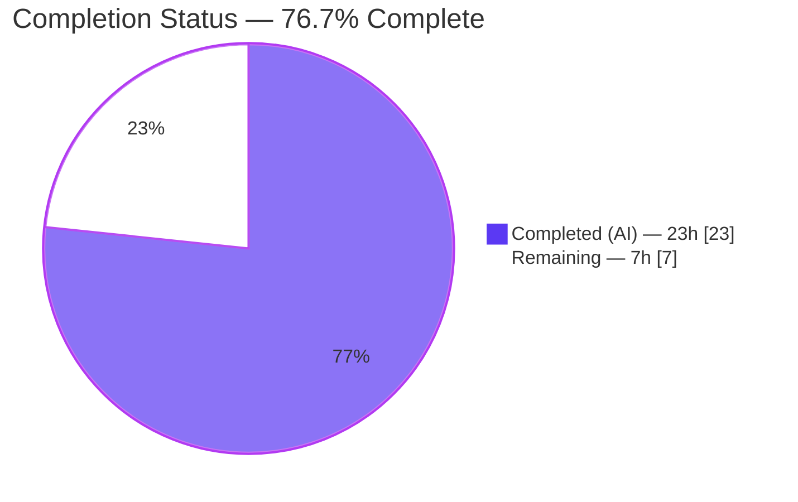
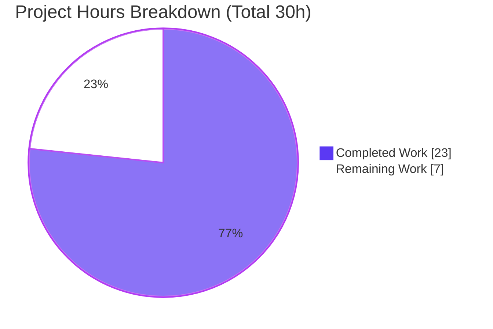

# Blitzy Project Guide
### hello_world — `GET /good-evening` Endpoint + Automated Test Suite

> **Brand legend:** <span style="color:#5B39F3">**Dark Blue (#5B39F3)**</span> = Completed / AI-delivered work · **White (#FFFFFF)** = Remaining / Not-yet-completed work · <span style="color:#B23AF2">**Violet-Black (#B23AF2)**</span> = headings/accents · <span style="color:#A8FDD9">**Mint (#A8FDD9)**</span> = highlights.

---

## 1. Executive Summary

### 1.1 Project Overview

This project extends an existing single-process Node.js/Express HTTP/HTTPS service (`hello_world` v2.0.0) by adding a second plain-text endpoint, `GET /good-evening` → `Good evening\n`, while preserving the original `GET /` → `Hello, World!\n` contract byte-for-byte. Because Express was already integrated (v4.x), the "add Express" request resolved to confirmation and documentation rather than a framework migration. Two user rules expanded scope: every new/modified line must carry an inline comment, and a full automated testing strategy (Jest + Supertest) must be created. Target users are API consumers and the maintaining engineering team; business impact is a documented, test-backed, security-hardened greeting API with zero audit findings.

### 1.2 Completion Status

**Completion is calculated using the PA1 AAP-scoped, hours-based methodology:**
`Completion % = Completed Hours / (Completed Hours + Remaining Hours) = 23 / (23 + 7) = 23 / 30 = 76.7%`



| Metric | Value |
|---|---|
| **Total Hours** | **30.0 h** |
| **Completed Hours (AI + Manual)** | **23.0 h** (23.0 AI · 0.0 Manual) |
| **Remaining Hours** | **7.0 h** |
| **Percent Complete** | **76.7%** |

> All AAP **feature** deliverables are 100% complete and validated. The 76.7% figure reflects that standard **path-to-production** work (human review/merge, CI/CD — explicitly deferred by the AAP — and deployment) remains.

### 1.3 Key Accomplishments

- ✅ **`GET /good-evening` (F-016) delivered** — returns `200`, `Content-Type: text/plain`, body `Good evening\n` (13 bytes, byte-verified at runtime).
- ✅ **Backward compatibility preserved** — `GET /` remains byte-identical `Hello, World!\n` (14 bytes); guarded by a regression test.
- ✅ **Express framework confirmed** — `express` 4.22.2 (4.x locked; no 5.x), application factory unchanged.
- ✅ **Automated test suite created (Rule 2)** — 4 suites, **39 tests, 100% passing**, mapped to AAP priorities P0–P3.
- ✅ **Coverage baseline established** — overall **99.12%** statements; `routes/index.js` at **100%** across all metrics; thresholds enforced (Jest exits 0).
- ✅ **Per-line comments (Rule 1)** — every new/modified line in `routes/index.js`, `jest.config.js`, and all 4 test files is commented.
- ✅ **Zero-finding audit (Constraint C4)** — `npm audit` reports 0 vulnerabilities via a dev-only `js-yaml@^4.2.0` override.
- ✅ **Documentation updated** — `README.md` API Endpoints table, Testing section, audit-hygiene note, and npm Scripts table.
- ✅ **Scope respected** — feature footprint is exactly the 9 in-scope files; all 7 out-of-scope runtime modules byte-identical; security pipeline order (F-015) unchanged.

### 1.4 Critical Unresolved Issues

| Issue | Impact | Owner | ETA |
|---|---|---|---|
| _None blocking_ | No issue blocks release or validation. All five production-readiness gates passed. | — | — |
| Transitive Jest deprecation warnings (`inflight`, `glob`) | Cosmetic only — warnings emitted by Jest's own dependency tree; **0** audit findings; no functional/runtime impact; not changeable without altering Jest internals | Maintainer (monitor) | On future Jest major upgrade |

### 1.5 Access Issues

| System / Resource | Type of Access | Issue Description | Resolution Status | Owner |
|---|---|---|---|---|
| Git repository (branch `blitzy-e6ec1a14-…`) | Read/Write | Branch present locally; 9 feature commits validated | ✅ No issue | — |
| npm registry | Read (install) | `npm ci` resolves 418 packages; lockfile in sync | ✅ No issue | — |
| TLS certificates (`certs/`) | Filesystem | No real certs committed (only `generate-certs.sh`); HTTPS in production requires provisioning | ⚠ Action required (path-to-production) | DevOps |

> Aside from TLS certificate provisioning required only if HTTPS is enabled in production, **no access issues** prevent build, test, or validation. The full suite, audit, and runtime were exercised successfully in this environment.

### 1.6 Recommended Next Steps

1. **[High]** Confirm the assumed route path `/good-evening` with the product owner (the AAP flagged this as an assumption); rename in `routes/index.js` + `routes.test.js` if a different path is desired. *(0.5 h)*
2. **[High]** Perform human code review of the 9-commit PR and merge to the integration/`main` branch. *(1.5 h)*
3. **[Medium]** Stand up a CI/CD pipeline running `npm ci → npm audit → npm test → npm run test:coverage` on push/PR with coverage gates (AAP §0.6.2 deferred this). *(3.0 h)*
4. **[Medium]** Deploy to the target environment, provision TLS certificates for HTTPS, and run a post-deploy smoke test against `/` and `/good-evening`. *(2.0 h)*
5. **[Low]** Add the CI deprecation-warning monitor / optional centralized logging as backlog items (no immediate action). *(0 h)*

---

## 2. Project Hours Breakdown

### 2.1 Completed Work Detail

| Component | Hours | Description |
|---|---|---|
| `GET /good-evening` route (R2 · F-016) | 1.5 | New handler in `routes/index.js` returning `text/plain` `Good evening\n`, JSDoc block + per-line inline comments, mirroring the `GET /` response chain |
| Express framework confirmation (R1) | 0.5 | Verified `express ^4.21.2` (resolved 4.22.2, 4.x locked) and the `app.js` factory; documented in README |
| Backward-compat preservation + regression test (R3) | 1.0 | Confirmed `GET /` byte-identical; designed the `Hello, World!\n` regression assertion |
| Test tooling & config | 2.5 | `jest.config.js` (node env, testMatch, `collectCoverageFrom`, risk-prioritized `coverageThreshold`) + `package.json` devDeps (`jest`, `supertest`) and `test` / `test:coverage` scripts |
| `__tests__/routes.test.js` (API/Integration) | 3.0 | 10 tests: `/good-evening`, `GET /` regression, `/health`, `/echo` valid+invalid, 404 + trailing-slash edges |
| `__tests__/app.test.js` (Integration) | 2.0 | 4 tests: Helmet security headers, CORS, OPTIONS preflight, 404 JSON envelope |
| `__tests__/middleware.test.js` (Unit) | 4.0 | 15 tests: `validator.handleValidationErrors`, `errorHandler` dev/prod envelopes, `rateLimiter` factory |
| `__tests__/config.test.js` (Unit) | 3.0 | 10 tests: `config/security.js` predicates/policy, `config/https.js` TLS defaults & certificate logic |
| npm audit zero-findings + lockfile regen (C4) | 2.0 | `js-yaml@^4.2.0` override investigation + `package-lock.json` regeneration to clear GHSA-h67p-54hq-rp68 |
| README documentation | 1.5 | API Endpoints table (incl. `/good-evening`), Testing section, audit-hygiene note, npm Scripts refresh |
| Autonomous validation & review-finding resolution | 2.0 | Multi-checkpoint validation, resolution of CP2 + final-checkpoint MAJOR findings + QA-1 trailing-slash case |
| **Total Completed** | **23.0** | _Matches Completed Hours in §1.2_ |

### 2.2 Remaining Work Detail

| Category | Hours | Priority |
|---|---|---|
| Stakeholder confirmation of assumed `/good-evening` route path | 0.5 | High |
| Human code review & merge to main/integration | 1.5 | High |
| CI/CD pipeline setup (AAP §0.6.2 deferred) | 3.0 | Medium |
| Production deployment, TLS provisioning & smoke test | 2.0 | Medium |
| **Total Remaining** | **7.0** | _Matches Remaining Hours in §1.2 and §7 pie_ |

### 2.3 Hours Reconciliation

| Check | Result |
|---|---|
| §2.1 Completed total | 23.0 h |
| §2.2 Remaining total | 7.0 h |
| §2.1 + §2.2 | **30.0 h = Total Project Hours (§1.2)** ✅ |
| Completion % | 23 / 30 = **76.7%** ✅ |

---

## 3. Test Results

All tests below originate from Blitzy's autonomous validation logs and were **re-executed firsthand** in this session (`CI=true npm test` and `npm run test:coverage`).

| Test Category | Framework | Total Tests | Passed | Failed | Coverage % | Notes |
|---|---|---|---|---|---|---|
| API / Integration (`routes.test.js`) | Jest + Supertest | 10 | 10 | 0 | `routes/index.js` 100% | `/good-evening` happy path, `GET /` regression, `/health`, `/echo` valid+invalid, 404 + trailing-slash edges |
| Integration (`app.test.js`) | Jest + Supertest | 4 | 4 | 0 | `app.js` 100% | Helmet headers (X-Frame-Options, HSTS, X-Powered-By removed), CORS, OPTIONS preflight, 404 envelope |
| Unit — Middleware (`middleware.test.js`) | Jest | 15 | 15 | 0 | errorHandler 100%, rateLimiter 100% | `validator`, `errorHandler` dev vs prod, `rateLimiter` factory |
| Unit — Config (`config.test.js`) | Jest | 10 | 10 | 0 | security.js 100%, https.js 94.73% | `/health` rate-limit skip, CORS/HSTS policy, TLS defaults & cert-presence logic |
| **Total** | **Jest + Supertest** | **39** | **39** | **0** | **99.12% overall** | 4 suites · 0 skipped · 0 flaky · `--detectOpenHandles` clean |

**Aggregate coverage (`jest --coverage`, thresholds enforced, exit 0):**

| Scope | % Stmts | % Branch | % Funcs | % Lines |
|---|---|---|---|---|
| All files | 99.12 | 85.96 | 100 | 99.10 |
| `routes/index.js` (P0) | 100 | 100 | 100 | 100 |
| `app.js` | 100 | 100 | 100 | 100 |
| `middleware/` | 100 | 83.87 | 100 | 100 |
| `config/` | 96.66 | 87.50 | 100 | 96.66 |

> Global thresholds (70/80/80/80) and the stricter route-layer thresholds (90/100/95/95) are all met with margin.

---

## 4. Runtime Validation & UI Verification

This is a backend HTTP/HTTPS API with **no UI** (no view engine, no static assets); "UI verification" is therefore endpoint/contract verification. All checks below were performed live in this session.

**Runtime health:**
- ✅ **Operational** — `node server.js` starts cleanly: `HTTP Server running at http://127.0.0.1:<PORT>/`.
- ✅ **Operational** — Graceful shutdown: `SIGTERM` → `"SIGTERM received. Starting graceful shutdown..."` → `"HTTP server closed"` → port released (verified on PORT 3555).
- ✅ **Operational** — `node --check` passes on all 13 JS files; `require('./app')` loads a valid Express app.

**Endpoint / API verification:**
- ✅ **Operational** — `GET /` → `200` `text/plain` `Hello, World!\n` (byte-exact, 14 bytes).
- ✅ **Operational** — `GET /good-evening` → `200` `text/plain` `Good evening\n` (byte-exact, 13 bytes via `od -c`).
- ✅ **Operational** — `GET /health` → `200` JSON `{"status":"ok","timestamp":<ms>}`.
- ✅ **Operational** — `POST /echo` (valid) → `200` `{"status":200,"message":"Echo successful","data":{...}}`; (invalid `{}`) → `400` validation envelope.
- ✅ **Operational** — Unknown path → `404` JSON envelope; **prod** mode (`NODE_ENV=production`) correctly omits the stack (`{"status":404,"message":"Not Found"}`), **dev** mode includes it.

**Security pipeline (verified present on `/good-evening`):**
- ✅ **Operational** — Helmet headers: `X-Frame-Options: SAMEORIGIN`, `Strict-Transport-Security: max-age=31536000; includeSubDomains`, `X-Content-Type-Options: nosniff`, `X-Powered-By` removed; CORS + rate-limit headers present. Pipeline order (F-015) unchanged.

---

## 5. Compliance & Quality Review

| AAP Deliverable / Benchmark | Requirement | Status | Evidence / Fix Applied |
|---|---|---|---|
| R1 — Express framework | Express is the app framework (4.x, no 5.x) | ✅ Pass | `express` 4.22.2 in lockfile; `app.js` factory unchanged |
| R2 — New endpoint (F-016) | `GET /good-evening` → `Good evening\n`, `text/plain`, `200` | ✅ Pass | Runtime byte-exact; `routes/index.js` 100% covered |
| R3 — Backward compatibility | `GET /` byte-identical `Hello, World!\n` | ✅ Pass | Diff shows `GET /` line unchanged; dedicated regression test |
| Rule 1 — Per-line comments | Every new/modified line commented | ✅ Pass | 3 new route lines + `jest.config.js` + all 4 test files commented (verified) |
| Rule 2 — Testing strategy | Jest + Supertest; unit/integration/API/edge; risk-prioritized | ✅ Pass | 4 suites / 39 tests mapped P0–P3; risk-tiered coverage thresholds |
| Manifest & tooling | devDeps + real `test` script + `test:coverage` | ✅ Pass | `jest ^30.4.2`, `supertest ^7.2.2`; `test=jest --ci`, `test:coverage=jest --coverage` |
| Constraint C4 — Supply chain | `npm audit` zero findings | ✅ Pass | 0 vulnerabilities; `js-yaml ^4.2.0` override clears GHSA-h67p-54hq-rp68 |
| F-015 — Pipeline immutability | Middleware order unchanged | ✅ Pass | 7 out-of-scope runtime files byte-identical to base |
| Documentation truthfulness | README lists endpoints + testing | ✅ Pass | API Endpoints table, Testing section, Scripts table added |
| Coverage baseline | Measurable coverage, route layer highest | ✅ Pass | 99.12% overall; `routes/index.js` 100%; thresholds enforced |
| Scope discipline | Only the 9 in-scope files changed | ✅ Pass | `git diff base..HEAD` = exactly 9 files; no out-of-scope edits |

**Outstanding compliance items:** None. All quality and compliance benchmarks pass. Fixes applied during autonomous validation included resolving 2 MAJOR final-checkpoint findings, CP2 review findings (locking the 5xx stack-omission test; documenting the js-yaml override), and adding a trailing-slash edge case (QA-1).

---

## 6. Risk Assessment

| Risk | Category | Severity | Probability | Mitigation | Status |
|---|---|---|---|---|---|
| Transitive Jest deprecation warnings (`inflight`, `glob`) | Technical | Low | High | Cosmetic only; 0 audit findings; revisit on Jest major upgrade | Accepted |
| `js-yaml ^4.2.0` override maintenance | Technical | Low | Low | Re-run `npm audit` whenever Jest/istanbul deps change | Mitigated |
| `/good-evening` is public + rate-limited (no auth) | Security | Low | Low | By design (static text, no data); inherits Helmet + rate-limit + CORS (verified) | Mitigated |
| No TLS certificates committed | Security | Medium | Medium | Run `npm run generate-certs` (dev) or provision CA certs (prod) before enabling HTTPS | Open (path-to-prod) |
| No CI/CD pipeline (AAP-deferred) | Operational | Medium | Medium | Add workflow running `npm ci`/`audit`/`test`/`coverage` with gates | Open (path-to-prod) |
| `node_modules/` + `coverage/` untracked | Operational | Low | Low | Intentional; documented — run `npm ci` on fresh clone | Mitigated |
| No centralized monitoring/log aggregation | Operational | Low | Low | Out of AAP scope; backlog for production hardening | Accepted |
| Assumed route path `/good-evening` unconfirmed | Integration | Low | Low–Med | Confirm with product owner; trivial rename + test update | Open |
| No external/DB integrations exist | Integration | Low | Low | Minimal integration surface (no DB, no third-party APIs) | N/A |

**Overall risk posture:** Low. No High-severity or release-blocking risks. The two Open items (TLS, CI/CD) and the route-path confirmation are standard path-to-production activities, not defects.

---

## 7. Visual Project Status

**Project hours breakdown** (Completed = Dark Blue #5B39F3, Remaining = White #FFFFFF):



**Remaining work by category** (sums to 7.0 h — consistent with §1.2 and §2.2):

| Category | Hours | Bar |
|---|---|---|
| CI/CD pipeline setup | 3.0 | ██████████████████ |
| Production deployment & TLS & smoke test | 2.0 | ████████████ |
| Code review & merge | 1.5 | █████████ |
| Stakeholder route-path confirmation | 0.5 | ███ |
| **Total** | **7.0** | |

> **Integrity check:** Pie "Remaining Work" = 7 h = §1.2 Remaining Hours = §2.2 Hours total. Pie "Completed Work" = 23 h = §1.2 Completed Hours = §2.1 total.

---

## 8. Summary & Recommendations

**Achievements.** The project is **76.7% complete** (23 of 30 AAP-scoped + path-to-production hours). Every AAP **feature** deliverable is finished and independently validated: the new `GET /good-evening` endpoint returns the exact `Good evening\n` payload through the unchanged security pipeline; the original `GET /` contract is preserved byte-for-byte; a 39-test Jest + Supertest suite passes at 99.12% coverage (100% on the route layer); both user rules (per-line comments, testing strategy) are satisfied; and `npm audit` is clean. The change set is exactly the 9 in-scope files with zero out-of-scope modification.

**Remaining gaps (7.0 h, all path-to-production).** (1) Confirm the assumed `/good-evening` path with stakeholders; (2) human code review and merge; (3) CI/CD pipeline — explicitly deferred by the AAP; (4) production deployment with TLS provisioning and a smoke test. None of these are feature defects.

**Critical path to production.** Confirm route path → code review & merge → CI/CD gate → deploy with TLS → smoke test. This is a short, low-risk path with no blocking issues.

**Success metrics (all met):** 39/39 tests passing · 0 audit findings · route layer 100% covered · byte-exact responses · pipeline order preserved · scope fully respected.

**Production readiness assessment:** **Code-complete and production-ready at the application level.** The remaining work is organizational/operational (review, automation, deployment) rather than engineering of the feature itself. Recommended action: proceed to review and merge, then automate and deploy.

| Metric | Value |
|---|---|
| Completion | 76.7% (23/30 h) |
| Tests | 39/39 passing |
| Coverage | 99.12% (routes 100%) |
| Audit | 0 vulnerabilities |
| Blocking issues | 0 |

---

## 9. Development Guide

### 9.1 System Prerequisites

- **Node.js** `>= 18.0.0` (validated on **v20.20.2**)
- **npm** (validated on **11.1.0**)
- **git** (with git-lfs available)
- **OpenSSL** — only required to generate self-signed certs for local HTTPS
- OS: Linux/macOS/WSL. No database, cache, or external services required.

### 9.2 Environment Setup

Copy the template and adjust as needed (all values have safe defaults):

```bash
cp .env.example .env
```

| Variable | Default | Purpose |
|---|---|---|
| `PORT` | `3000` | HTTP listen port |
| `HTTPS_PORT` | `3443` | HTTPS listen port |
| `HTTPS_ENABLED` | `false` | Set `true` to enable the HTTPS server |
| `NODE_ENV` | `development` | `production` hardens error envelopes (omits stack) |
| `CORS_ORIGIN` | `http://localhost:3000` | Allowed CORS origin(s) |
| `RATE_LIMIT_WINDOW_MS` | `900000` | Rate-limit window (15 min) |
| `RATE_LIMIT_MAX` | `100` | Max requests per window |
| `SSL_KEY_PATH` | `./certs/key.pem` | TLS private key path |
| `SSL_CERT_PATH` | `./certs/cert.pem` | TLS certificate path |
| `HOST` | `127.0.0.1` | Bind address (optional) |

### 9.3 Dependency Installation

```bash
# Reproducible install from the lockfile (~418 packages)
CI=true npm ci

# Confirm zero vulnerabilities (Constraint C4)
npm audit
# → found 0 vulnerabilities
```

### 9.4 Running the Tests

```bash
# Full suite (non-interactive)
CI=true npm test
# → Test Suites: 4 passed, 4 total
# → Tests:       39 passed, 39 total

# With coverage (thresholds enforced; exits non-zero if unmet)
CI=true npm run test:coverage
# → All files ... 99.12 | 85.96 | 100 | 99.1
```

### 9.5 Application Startup

```bash
# HTTP (foreground)
PORT=3000 node server.js
# → HTTP Server running at http://127.0.0.1:3000/

# Or via npm
npm start                 # production server
npm run dev               # nodemon (auto-reload)

# HTTPS (optional)
npm run generate-certs    # creates certs/key.pem + certs/cert.pem
HTTPS_ENABLED=true npm start
# → HTTPS Server running at https://127.0.0.1:3443/
```

### 9.6 Verification & Example Usage

```bash
# Original greeting (backward compatibility)
curl http://127.0.0.1:3000/
# → Hello, World!

# New endpoint (F-016)
curl http://127.0.0.1:3000/good-evening
# → Good evening

# Health probe
curl http://127.0.0.1:3000/health
# → {"status":"ok","timestamp":1781807393767}

# Echo (valid)
curl -X POST http://127.0.0.1:3000/echo \
  -H "Content-Type: application/json" \
  -d '{"message":"hello"}'
# → {"status":200,"message":"Echo successful","data":{"message":"hello"}}

# Echo (invalid → 400 validation envelope)
curl -X POST http://127.0.0.1:3000/echo \
  -H "Content-Type: application/json" -d '{}'
# → {"status":400,"message":"Validation failed","errors":[...]}

# Unknown path → 404 envelope
curl http://127.0.0.1:3000/nonexistent
# → {"status":404,"message":"Not Found", ...}   (stack omitted when NODE_ENV=production)
```

**Graceful shutdown:**

```bash
# Find the node PID and send SIGTERM (or press Ctrl+C in the foreground)
kill -TERM <pid>
# → SIGTERM received. Starting graceful shutdown...
# → HTTP server closed     (port released)
```

### 9.7 Troubleshooting

| Symptom | Cause | Resolution |
|---|---|---|
| `[HTTP] Port <PORT> is already in use` (process exits 1) | Another process holds the port | Set a different `PORT`, or stop the conflicting process |
| `[HTTPS] HTTPS_ENABLED is true but certificates are missing` | No TLS certs present | Run `npm run generate-certs` (dev) or provision real certs and set `SSL_KEY_PATH`/`SSL_CERT_PATH` |
| `npm warn deprecated inflight@…` / `glob@…` during install | Transitive deps of Jest | Harmless — 0 audit findings; resolves with future Jest upgrades |
| Tests fail right after clone | Dependencies not installed | Run `CI=true npm ci` first (`node_modules/` is intentionally untracked) |
| `POST /echo` returns 400 unexpectedly | Missing/empty `message` field | Send a JSON body with a non-empty `message` (1–500 chars) |

---

## 10. Appendices

### A. Command Reference

| Command | Purpose |
|---|---|
| `CI=true npm ci` | Reproducible dependency install from lockfile |
| `npm audit` | Security audit (expect 0 vulnerabilities) |
| `CI=true npm test` | Run the Jest suite (`jest --ci`) |
| `CI=true npm run test:coverage` | Run suite with coverage + threshold enforcement |
| `npm start` | Start production server (`node server.js`) |
| `npm run dev` | Start dev server with nodemon |
| `npm run generate-certs` | Generate self-signed TLS certs for local HTTPS |
| `node --check <file>` | Syntax-check a JS file (no execution) |

### B. Port Reference

| Port | Service | Env Var | Default |
|---|---|---|---|
| HTTP | Express HTTP server | `PORT` | `3000` |
| HTTPS | Express HTTPS server | `HTTPS_PORT` | `3443` |

### C. Key File Locations

| Path | Role | Disposition |
|---|---|---|
| `routes/index.js` | Application router (all endpoints; the new route) | **Modified** |
| `package.json` | Manifest (devDeps + test scripts + js-yaml override) | **Modified** |
| `package-lock.json` | Locked dependency tree (~418 pkgs) | **Modified (auto)** |
| `README.md` | API + Testing documentation | **Modified** |
| `jest.config.js` | Jest config (coverage thresholds) | **Created** |
| `__tests__/routes.test.js` | API/integration tests | **Created** |
| `__tests__/app.test.js` | App-level integration tests | **Created** |
| `__tests__/middleware.test.js` | Middleware unit tests | **Created** |
| `__tests__/config.test.js` | Config unit tests | **Created** |
| `app.js` | Express factory (mounts router, middleware pipeline) | Reference (unchanged) |
| `server.js` | HTTP/HTTPS bootstrap + graceful shutdown | Reference (unchanged) |
| `config/`, `middleware/` | Security config + middleware | Reference (unchanged) |
| `certs/generate-certs.sh` | Self-signed cert generator | Reference (unchanged) |

### D. Technology Versions

| Component | Version |
|---|---|
| Node.js | v20.20.2 (engines `>=18.0.0`) |
| npm | 11.1.0 |
| express | 4.22.2 (4.x locked) |
| helmet | ^8.1.0 |
| cors | ^2.8.5 |
| express-rate-limit | ^8.2.1 |
| express-validator | ^7.3.1 |
| jest (dev) | ^30.4.2 (resolved 30.4.2) |
| supertest (dev) | ^7.2.2 (resolved 7.2.2) |
| nodemon / dotenv (dev) | ^3.1.0 / ^16.4.5 |

### E. Environment Variable Reference

See §9.2 for the full table. Summary: `PORT`, `HTTPS_PORT`, `HTTPS_ENABLED`, `NODE_ENV`, `CORS_ORIGIN`, `RATE_LIMIT_WINDOW_MS`, `RATE_LIMIT_MAX`, `SSL_KEY_PATH`, `SSL_CERT_PATH`, `HOST`. No new variables were introduced by this feature.

### F. Developer Tools Guide

| Tool | Usage |
|---|---|
| Jest | Test runner + assertions + coverage. Config in `jest.config.js`; tests under `__tests__/**/*.test.js` |
| Supertest | In-process HTTP assertions against the exported `app` factory (no port binding) |
| nodemon | Auto-reload dev server (`npm run dev`) |
| dotenv | Loads `.env` for local configuration |
| npm audit | Supply-chain vulnerability scanning (gated to 0 findings) |

### G. Glossary

| Term | Meaning |
|---|---|
| **F-016** | Catalog ID for the new "Good evening" endpoint feature |
| **F-015** | Deterministic middleware pipeline (helmet → rate-limit → CORS → body-parsing); order is immutable |
| **C4** | Constraint requiring `npm audit` to report zero findings |
| **Path-to-production** | Standard activities (review, CI/CD, deployment) to ship a completed deliverable |
| **AAP** | Agent Action Plan — the authoritative project specification |
| **Backward compatibility** | Preserving the exact `GET /` → `Hello, World!\n` response contract |

---

*Completion (76.7%), hours (23 completed / 7 remaining / 30 total), and test results (39/39) are consistent across Sections 1.2, 2.1, 2.2, 3, 7, and 8. All listed tests originate from Blitzy's autonomous validation logs and were re-verified firsthand in this session.*