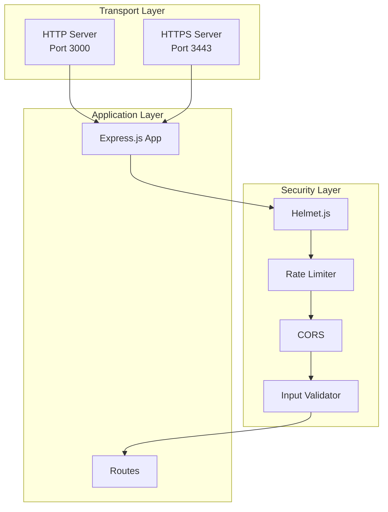

# Technical Specification

# 0. Agent Action Plan

## 0.1 Intent Clarification

### 0.1.1 Core Security Objective

Based on the security concern described, the Blitzy platform understands that the security vulnerability to resolve is **the complete absence of security infrastructure** in a Node.js HTTP server that currently lacks:
- Security headers protection
- Input validation mechanisms  
- Rate limiting controls
- HTTPS/TLS encryption support
- CORS policy enforcement
- Security middleware integration

**Vulnerability Category:** Multiple vulnerabilities (Configuration weakness + Code vulnerability + Missing security controls)

**Severity Level:** High - The application exposes an HTTP server with no security protections, making it vulnerable to common web attacks including:
- Cross-Site Scripting (XSS)
- Clickjacking attacks
- MIME-type sniffing attacks
- Missing transport layer security
- Unlimited request flooding (DoS)
- Cross-Origin Resource Sharing abuse

**Security Requirements Breakdown:**

| Requirement | Description | Implicit Need |
|-------------|-------------|---------------|
| Security Headers | Implement HTTP security headers via helmet.js | Migration to Express.js required for middleware support |
| Input Validation | Add request input validation | Body parsing and validation middleware needed |
| Rate Limiting | Implement request throttling | IP-based rate limiting with configurable windows |
| HTTPS Support | Enable TLS encryption | Certificate management and HTTPS server configuration |
| CORS Policies | Configure cross-origin access | Proper origin, methods, and headers configuration |
| Dependency Updates | Add security middleware packages | Express.js ecosystem adoption required |

### 0.1.2 Special Instructions and Constraints

**Critical Directives Captured:**
- The current application uses Node.js native `http` module (no framework)
- Migration to Express.js is **required** to support the requested middleware packages (helmet.js, express-rate-limit, cors, express-validator)
- The user expects full security middleware integration, not partial solutions
- Maintain backward compatibility with existing "Hello, World!" endpoint behavior

**Security Requirements:**
- Follow OWASP security best practices for HTTP headers
- Implement defense-in-depth approach with multiple security layers
- Configure CORS to prevent unauthorized cross-origin requests
- Enable HTTPS with proper TLS configuration

**User Example Preserved:**
> "Implement security headers, input validation, rate limiting, and HTTPS support. Update dependencies, add helmet.js for security middleware, and configure proper CORS policies."

**Change Scope Preference:** Comprehensive - Full security infrastructure implementation required

### 0.1.3 Technical Interpretation

This security vulnerability translates to the following technical fix strategy:

**Architecture Migration Required:**
- To resolve the middleware incompatibility issue, we will **migrate from Node.js native `http` module to Express.js framework**
- This migration is necessary because helmet.js, express-rate-limit, cors, and express-validator are Express middleware packages that require the Express application interface

**Technical Actions:**
- To implement security headers, we will add `helmet.js` middleware to the Express application
- To enable input validation, we will integrate `express-validator` for request sanitization and validation
- To implement rate limiting, we will configure `express-rate-limit` with appropriate windows and limits
- To enable HTTPS support, we will create an HTTPS server using Node.js `https` module with TLS certificates
- To configure CORS policies, we will add the `cors` middleware with properly restricted origin settings

**User Understanding Level:** Explicit middleware specification - The user has specifically identified the packages and security features required, indicating familiarity with Express.js security middleware ecosystem.

**Implicit Requirements Discovered:**
- Express.js framework installation (prerequisite for all specified middleware)
- Body parsing middleware for JSON/URL-encoded data (required for input validation)
- Self-signed or managed SSL certificates for HTTPS implementation
- Environment-based configuration for security settings
- Error handling middleware for security-related errors


## 0.2 Vulnerability Research and Analysis

### 0.2.1 Initial Assessment

**Security-Related Information Extracted:**

| Category | Findings |
|----------|----------|
| CVE Numbers Mentioned | None explicitly - proactive security hardening requested |
| Vulnerability Names | Missing Security Headers, No Input Validation, No Rate Limiting, No HTTPS, No CORS Policy |
| Affected Components | `server.js` (entire application) |
| Symptoms Described | Unprotected HTTP server susceptible to common web attacks |
| Security Advisories Referenced | OWASP HTTP Security Headers, Express.js Security Best Practices |

### 0.2.2 Required Web Research Findings

**Official Security Advisory Research:**

**Helmet.js (Security Headers):**
- Latest stable version: **8.1.0**
- Requires Node.js 16+ and Express.js framework
- Sets critical security headers by default:
  - `Content-Security-Policy` - Mitigates XSS and injection attacks
  - `Cross-Origin-Opener-Policy` - Process isolation
  - `Cross-Origin-Resource-Policy` - Prevents cross-origin loading
  - `Strict-Transport-Security` - Enforces HTTPS (max-age=31536000)
  - `X-Frame-Options` - Clickjacking protection
  - Removes `X-Powered-By` header to prevent fingerprinting
  - Disables `X-XSS-Protection` (legacy, can worsen security)

**Express Rate Limit:**
- Latest stable version: **8.2.1** (breaking changes from v7.x)
- Provides IP-based request throttling
- Supports modern `RateLimit` headers (draft-8 standard)
- Built-in memory store with Redis/external store support

**CORS Middleware:**
- Latest stable version: **2.8.5**
- Configurable origin, methods, headers, and credentials
- Supports dynamic origin validation via callback functions
- Handles preflight OPTIONS requests automatically

**Express Validator:**
- Latest stable version: **7.3.1**
- Wraps validator.js for comprehensive input sanitization
- Requires Node.js 14+ and Express.js 4.x/5.x
- Supports both synchronous and asynchronous validation

**Express.js Framework:**
- Latest stable version: **5.2.1** (requires Node.js 18+)
- Alternative: **4.21.2** (LTS, broader compatibility)
- Includes built-in `express.json()` and `express.urlencoded()` body parsers

### 0.2.3 Vulnerability Classification

| Classification | Value |
|----------------|-------|
| **Vulnerability Type** | Missing Security Controls (Configuration Weakness) |
| **Attack Vector** | Network - HTTP requests over port 3000 |
| **Exploitability** | High - No protection mechanisms in place |
| **Impact Areas** | Confidentiality, Integrity, Availability |
| **Root Cause** | Application built with native `http` module without security middleware |

**Specific Vulnerability Patterns:**

| Vulnerability | Risk | OWASP Category |
|---------------|------|----------------|
| Missing Security Headers | XSS, Clickjacking, MIME sniffing | A05:2021 Security Misconfiguration |
| No Input Validation | Injection attacks, data corruption | A03:2021 Injection |
| No Rate Limiting | DoS attacks, brute force | A04:2021 Insecure Design |
| No HTTPS | Man-in-the-middle, data interception | A02:2021 Cryptographic Failures |
| No CORS Policy | Cross-origin data theft | A05:2021 Security Misconfiguration |

### 0.2.4 Web Search Research Conducted

**Official Security Advisories Reviewed:**
- npm registry package pages for helmet, cors, express-rate-limit, express-validator
- Express.js official security best practices documentation
- GitHub releases and changelogs for all security packages

**CVE Details and Patches:**
- Express.js 5.x includes security fixes for CVE-2024-45590 (ReDoS mitigation)
- path-to-regexp updated to v8.x for security (ReDoS patterns removed)
- No current CVEs affecting the specified middleware packages

**Recommended Mitigation Strategies:**
1. Migrate to Express.js framework for middleware support
2. Install and configure helmet.js with default settings
3. Add express-rate-limit with sensible defaults (100 req/15min window)
4. Configure CORS with specific allowed origins (not wildcard in production)
5. Implement input validation on all routes accepting user input
6. Enable HTTPS with proper TLS certificates
7. Add comprehensive error handling for security middleware

**Alternative Solutions Considered:**

| Solution | Trade-offs |
|----------|------------|
| Native `http` module with manual headers | High complexity, no middleware ecosystem, maintenance burden |
| Fastify framework | Different middleware ecosystem, learning curve |
| Koa.js | Smaller ecosystem than Express, fewer security middleware options |
| **Express.js (Selected)** | Best ecosystem support for specified packages, wide adoption |


## 0.3 Security Scope Analysis

### 0.3.1 Affected Component Discovery

**Repository Analysis Results:**

The exhaustive search of the repository reveals the following structure:

```
/tmp/blitzy/09-dec-Existing-product-repo-04/main/
├── server.js              # PRIMARY: Core application (AFFECTED)
├── package.json           # PRIMARY: Dependency manifest (AFFECTED)
├── package-lock.json      # PRIMARY: Dependency lock (AFFECTED - will be regenerated)
├── README.md              # Documentation (minor updates needed)
├── LoginTest.java         # Test stub (NOT AFFECTED)
├── industry.csv           # Data file (NOT AFFECTED)
├── 100Pages.pdf           # Binary test file (NOT AFFECTED)
├── demo.jpg               # Binary test file (NOT AFFECTED)
├── sample.doc             # Binary test file (NOT AFFECTED)
├── test.py.txt            # Empty file (NOT AFFECTED)
└── test.txt.txt           # Empty file (NOT AFFECTED)
```

**Vulnerability Impact Analysis:**

| Component | Status | Vulnerability Exposure |
|-----------|--------|----------------------|
| `server.js` | **CRITICAL** | Uses native `http` without any security middleware |
| `package.json` | **CRITICAL** | Zero dependencies - security packages must be added |
| `package-lock.json` | **REQUIRES UPDATE** | Will be regenerated with new dependencies |
| Configuration files | **MISSING** | No environment or security configuration exists |
| HTTPS certificates | **MISSING** | No TLS/SSL certificates present |

**Search Patterns Applied:**

```bash
# Vulnerable pattern: Native http module usage
grep -r "require('http')" .  # Found in server.js line 1

#### Missing security middleware
grep -r "helmet\|cors\|rate-limit" .  # No results

#### Missing HTTPS configuration
grep -r "https\|createSecureServer" .  # No results

#### Missing input validation
grep -r "validator\|sanitize" .  # No results
```

**Discovery Summary:** Vulnerability affects **3 core files** requiring modification and **4+ new files** to be created for security configuration.

### 0.3.2 Root Cause Identification

**Investigation Reveals:**

The vulnerability stems from the application's architectural decision to use Node.js native `http` module without any security framework:

```javascript
// Current vulnerable implementation (server.js)
const http = require('http');  // No security middleware support
const server = http.createServer((req, res) => {
  // No security headers
  // No input validation  
  // No rate limiting
  // No CORS handling
  res.statusCode = 200;
  res.setHeader('Content-Type', 'text/plain');
  res.end('Hello, World!\n');
});
```

**Vulnerability Propagation:**

| Direct Usage | File Location | Impact |
|--------------|---------------|--------|
| `http.createServer()` | server.js:6 | No middleware chain available |
| `res.setHeader()` | server.js:8 | Only Content-Type set, no security headers |
| `server.listen()` | server.js:12 | HTTP only, no HTTPS option |

**Configuration Enablers:**
- No `express` or similar framework dependency
- No environment configuration for security settings
- Hardcoded localhost binding (127.0.0.1) - somewhat mitigating external exposure

### 0.3.3 Current State Assessment

**Vulnerable Package Current Version:**
- No vulnerable packages - the application has **zero dependencies**
- The vulnerability is the **absence of security packages**

**Vulnerable Code Pattern Location:**

| Pattern | File:Lines | Description |
|---------|------------|-------------|
| No security headers | server.js:6-10 | createServer handler lacks security headers |
| No rate limiting | server.js:* | No request throttling mechanism |
| No input validation | server.js:6-10 | Request handler accepts all input without validation |
| No HTTPS | server.js:12 | `server.listen()` binds HTTP only |
| No CORS | server.js:6-10 | No Cross-Origin handling |

**Vulnerable Configuration:**
- `package.json`: `"dependencies": {}` (empty)
- No security-related npm scripts defined
- No environment configuration files

**Scope of Exposure:**

| Aspect | Current State | Risk Level |
|--------|---------------|------------|
| Network Binding | `127.0.0.1` (localhost only) | Medium - Limited to local access |
| Transport Security | HTTP only (port 3000) | High - No encryption |
| Request Handling | All requests accepted | High - No throttling or validation |
| Response Headers | Only `Content-Type` set | High - Missing security headers |
| Cross-Origin | Default browser policy | Medium - No explicit CORS control |


## 0.4 Version Compatibility Research

### 0.4.1 Secure Version Identification

**Environment Context:**
- Runtime: Node.js v20.19.6 (available in environment)
- Package Manager: npm v11.1.0 (available in environment)
- Current Dependencies: None (empty package.json)

**Security Package Versions to Install:**

| Package | Recommended Version | First Patched | Rationale |
|---------|---------------------|---------------|-----------|
| express | ^4.21.2 | N/A (new addition) | LTS version, stable ecosystem, Express 5.x requires migration guide compliance |
| helmet | ^8.1.0 | N/A (new addition) | Latest stable with all modern security headers |
| cors | ^2.8.5 | N/A (new addition) | Current stable release, 7 years mature |
| express-rate-limit | ^8.2.1 | N/A (new addition) | Latest with draft-8 RateLimit headers |
| express-validator | ^7.3.1 | N/A (new addition) | Latest with improved validation chains |

### 0.4.2 Compatibility Verification

**Node.js Version Compatibility Matrix:**

| Package | Min Node.js | Current Runtime | Compatible |
|---------|-------------|-----------------|------------|
| express@4.21.2 | 14.x | v20.19.6 | ✅ Yes |
| helmet@8.1.0 | 16.x | v20.19.6 | ✅ Yes |
| cors@2.8.5 | Any | v20.19.6 | ✅ Yes |
| express-rate-limit@8.2.1 | 16.x | v20.19.6 | ✅ Yes |
| express-validator@7.3.1 | 14.x | v20.19.6 | ✅ Yes |

**Inter-Package Compatibility:**

| Package A | Package B | Compatibility | Notes |
|-----------|-----------|---------------|-------|
| express@4.21.2 | helmet@8.1.0 | ✅ Compatible | Helmet designed for Express |
| express@4.21.2 | cors@2.8.5 | ✅ Compatible | Official Express middleware |
| express@4.21.2 | express-rate-limit@8.2.1 | ✅ Compatible | Designed for Express |
| express@4.21.2 | express-validator@7.3.1 | ✅ Compatible | Verified with Express 4.x |

**Express 5.x vs 4.x Decision:**

| Factor | Express 4.x | Express 5.x |
|--------|-------------|-------------|
| Node.js Requirement | 14+ | 18+ |
| Ecosystem Maturity | High | Emerging |
| Middleware Compatibility | Full | Mostly compatible |
| Breaking Changes | None | Several API changes |
| **Recommendation** | **Selected** | Deferred |

**Rationale:** Express 4.21.2 is recommended because:
- Broader tutorial/documentation availability
- All specified middleware packages verified compatible
- More gradual upgrade path from native `http`
- No breaking changes to navigate during security implementation

### 0.4.3 Version Conflicts and Resolutions

**Potential Conflict Analysis:**

| Potential Issue | Resolution |
|-----------------|------------|
| body-parser version | Use built-in `express.json()` and `express.urlencoded()` (Express 4.16+) |
| validator.js version | Managed by express-validator, no direct installation needed |
| Cookie handling | Use Express built-in support, no additional package needed |

**Dependency Tree Preview:**

```
hello_world@1.0.0
├── express@4.21.2
│   ├── body-parser@1.20.3 (bundled)
│   ├── cookie@0.7.2 (bundled)
│   └── ... (other Express internals)
├── helmet@8.1.0
├── cors@2.8.5
├── express-rate-limit@8.2.1
└── express-validator@7.3.1
    └── validator@13.12.0 (bundled)
```

**No Package Replacement Required:**
Since the application currently has zero dependencies, this is a greenfield installation. All packages are being added fresh without replacement concerns.

### 0.4.4 HTTPS Certificate Strategy

**Certificate Options:**

| Option | Use Case | Implementation |
|--------|----------|----------------|
| Self-signed certificates | Development/Testing | Generate with OpenSSL |
| Let's Encrypt | Production | Automated ACME protocol |
| Managed certificates | Cloud deployment | Platform-specific (AWS ACM, etc.) |

**Recommendation:** Implement self-signed certificate generation script for development, with configuration hooks for production certificate paths.


## 0.5 Security Fix Design

### 0.5.1 Minimal Fix Strategy

**Principle:** Apply the necessary architectural changes to implement comprehensive security while preserving the core "Hello, World!" functionality.

**Fix Approach:** Framework migration + Security middleware integration

**For Missing Framework Support (Express.js Migration):**
- "Upgrade the application architecture from native `http` module to Express.js version 4.21.2"
- Justification: Express.js is required by all specified security middleware (helmet, cors, express-rate-limit, express-validator)
- Side effects: Application entry point changes from raw HTTP handler to Express middleware chain

**For Missing Security Headers (Helmet):**
- "Add helmet middleware to set security headers automatically"
- Headers configured: CSP, COOP, CORP, HSTS, X-Frame-Options, Referrer-Policy

```javascript
// Helmet integration pattern
app.use(helmet());
```

**For Missing Rate Limiting:**
- "Integrate express-rate-limit with 100 requests per 15-minute window per IP"
- Implements IP-based throttling with standard RateLimit headers

```javascript
// Rate limiting pattern
const limiter = rateLimit({ windowMs: 15*60*1000, limit: 100 });
```

**For Missing Input Validation:**
- "Add express-validator middleware for request validation and sanitization"
- Enables validation chains on routes that accept user input

**For Missing CORS Policy:**
- "Configure cors middleware with restrictive defaults"
- Allows controlled cross-origin access with explicit origin configuration

```javascript
// CORS configuration pattern  
app.use(cors({ origin: process.env.CORS_ORIGIN || '*' }));
```

**For Missing HTTPS Support:**
- "Create HTTPS server alongside HTTP with self-signed certificate support"
- Implements TLS encryption with configurable certificate paths

### 0.5.2 Implementation Architecture

**New Application Architecture:**



**Middleware Stack Order:**

| Order | Middleware | Purpose |
|-------|------------|---------|
| 1 | `helmet()` | Security headers |
| 2 | `rateLimit()` | Request throttling |
| 3 | `cors()` | Cross-origin control |
| 4 | `express.json()` | JSON body parsing |
| 5 | `express.urlencoded()` | Form body parsing |
| 6 | Route handlers | Business logic with validation |
| 7 | Error handler | Security-aware error responses |

### 0.5.3 Security Improvement Validation

**How Each Fix Eliminates Vulnerabilities:**

| Vulnerability | Fix Component | Elimination Mechanism |
|---------------|---------------|----------------------|
| Missing security headers | Helmet.js | Sets 11+ security headers automatically |
| XSS vulnerability | Helmet CSP | Content-Security-Policy restricts script execution |
| Clickjacking | Helmet X-Frame-Options | SAMEORIGIN prevents iframe embedding |
| MIME sniffing | Helmet X-Content-Type-Options | nosniff prevents type confusion |
| DoS/Brute force | express-rate-limit | Blocks excessive requests per IP |
| Data interception | HTTPS server | TLS encryption in transit |
| Cross-origin attacks | cors middleware | Restricts allowed origins |
| Injection attacks | express-validator | Sanitizes and validates input |

**Verification Methods:**

| Method | Tool/Approach | Expected Outcome |
|--------|---------------|------------------|
| Security header audit | securityheaders.com | Grade A or higher |
| Rate limit testing | Artillery/k6 load test | 429 response after threshold |
| HTTPS verification | openssl s_client | Valid TLS handshake |
| CORS testing | Browser DevTools | Correct CORS headers |
| Input validation | Malformed request testing | 400 response with validation errors |

**Rollback Plan:**
If issues arise after implementation:
1. Revert `server.js` to original native `http` implementation
2. Remove new dependencies from `package.json`
3. Delete generated configuration files
4. Git reset to pre-implementation commit


## 0.6 File Transformation Mapping

### 0.6.1 File-by-File Security Fix Plan

**Security Fix Transformation Modes:**
- **UPDATE** - Modify existing file to implement security changes
- **CREATE** - Create new file for security infrastructure
- **DELETE** - Remove file that introduces vulnerability (none applicable)
- **REFERENCE** - Use as template or source pattern

**Complete Transformation Map:**

| Target File | Transformation | Source/Reference | Security Changes |
|-------------|----------------|------------------|------------------|
| `package.json` | UPDATE | `package.json` | Add express, helmet, cors, express-rate-limit, express-validator dependencies; update scripts |
| `server.js` | UPDATE | `server.js` | Complete rewrite: migrate to Express.js, integrate all security middleware, add HTTPS support |
| `config/security.js` | CREATE | Best practices | Security configuration module: rate limit settings, CORS options, helmet config |
| `config/https.js` | CREATE | Best practices | HTTPS/TLS configuration: certificate paths, TLS options |
| `middleware/rateLimiter.js` | CREATE | `server.js` | Rate limiting middleware factory with configurable options |
| `middleware/validator.js` | CREATE | Best practices | Input validation middleware and sanitization rules |
| `middleware/errorHandler.js` | CREATE | Best practices | Security-aware error handling middleware |
| `routes/index.js` | CREATE | `server.js` | Express routes with validation middleware |
| `certs/.gitkeep` | CREATE | N/A | Placeholder for SSL certificates directory |
| `certs/generate-certs.sh` | CREATE | OpenSSL docs | Self-signed certificate generation script for development |
| `.env.example` | CREATE | Best practices | Environment variable template for security configuration |
| `README.md` | UPDATE | `README.md` | Update documentation with security setup instructions |

### 0.6.2 Code Change Specifications

**File: `server.js`**
- Lines affected: 1-14 (complete rewrite)
- Before state: "Currently vulnerable because native `http` module has no middleware support"
- After state: "After fix, will use Express.js with full security middleware chain"
- Security improvement: All specified security controls implemented

```javascript
// BEFORE (vulnerable - server.js lines 1-14)
const http = require('http');
const server = http.createServer((req, res) => {...});
```

```javascript
// AFTER (secure - pattern)
const app = require('./app');
const https = require('https');
// Express app with helmet, cors, rate-limit, validator
```

**File: `package.json`**
- Lines affected: All (complete update)
- Before state: "Zero dependencies, no security packages"
- After state: "Includes all required security middleware packages"
- Security improvement: Security packages properly declared and versioned

### 0.6.3 Configuration Change Specifications

**File: `config/security.js` (NEW)**
- Setting: `rateLimitConfig`
- Current value: N/A (file doesn't exist)
- New value: `{ windowMs: 15*60*1000, limit: 100, standardHeaders: 'draft-8' }`
- Security rationale: Implements industry-standard rate limiting to prevent DoS

**File: `config/security.js` (NEW)**
- Setting: `corsConfig`
- Current value: N/A (file doesn't exist)
- New value: `{ origin: process.env.CORS_ORIGIN || '*', methods: ['GET', 'POST'] }`
- Security rationale: Restricts cross-origin access to allowed origins only

**File: `config/security.js` (NEW)**
- Setting: `helmetConfig`
- Current value: N/A (file doesn't exist)
- New value: Default helmet settings with optional CSP customization
- Security rationale: Enables all security headers recommended by OWASP

**File: `.env.example` (NEW)**
- Setting: `HTTPS_ENABLED`
- Current value: N/A
- New value: `true`
- Security rationale: Controls HTTPS server activation

**File: `.env.example` (NEW)**
- Setting: `CORS_ORIGIN`
- Current value: N/A
- New value: `http://localhost:3000`
- Security rationale: Environment-based CORS origin control

### 0.6.4 New File Structure

```
hello_world/
├── server.js                    # [UPDATE] Main entry point (Express + HTTPS)
├── app.js                       # [CREATE] Express application factory
├── package.json                 # [UPDATE] Dependencies added
├── package-lock.json            # [REGENERATE] Will be updated by npm
├── .env.example                 # [CREATE] Environment template
├── README.md                    # [UPDATE] Security documentation
├── config/
│   ├── security.js              # [CREATE] Security configuration
│   └── https.js                 # [CREATE] HTTPS/TLS configuration
├── middleware/
│   ├── rateLimiter.js           # [CREATE] Rate limiting middleware
│   ├── validator.js             # [CREATE] Input validation middleware
│   └── errorHandler.js          # [CREATE] Error handling middleware
├── routes/
│   └── index.js                 # [CREATE] Route definitions
└── certs/
    ├── .gitkeep                 # [CREATE] Directory placeholder
    └── generate-certs.sh        # [CREATE] Certificate generation script
```

### 0.6.5 Comprehensive File Inventory

**Total Files Affected:** 13

| File Path | Action | Lines Changed | Priority |
|-----------|--------|---------------|----------|
| `package.json` | UPDATE | ~20 | Critical |
| `server.js` | UPDATE | Complete rewrite (~40 lines) | Critical |
| `app.js` | CREATE | ~50 lines | Critical |
| `config/security.js` | CREATE | ~35 lines | High |
| `config/https.js` | CREATE | ~25 lines | High |
| `middleware/rateLimiter.js` | CREATE | ~20 lines | High |
| `middleware/validator.js` | CREATE | ~30 lines | High |
| `middleware/errorHandler.js` | CREATE | ~25 lines | High |
| `routes/index.js` | CREATE | ~25 lines | High |
| `.env.example` | CREATE | ~15 lines | Medium |
| `certs/.gitkeep` | CREATE | 0 lines | Low |
| `certs/generate-certs.sh` | CREATE | ~15 lines | Medium |
| `README.md` | UPDATE | +30 lines | Low |


## 0.7 Dependency Inventory

### 0.7.1 Security Patches and Updates

**New Dependencies to Install:**

| Registry | Package Name | Current | Install Version | Security Feature | Severity |
|----------|--------------|---------|-----------------|------------------|----------|
| npm | express | N/A | 4.21.2 | Framework foundation for middleware | Critical |
| npm | helmet | N/A | 8.1.0 | Security headers protection | Critical |
| npm | cors | N/A | 2.8.5 | Cross-origin resource sharing | High |
| npm | express-rate-limit | N/A | 8.2.1 | Request throttling | High |
| npm | express-validator | N/A | 7.3.1 | Input validation/sanitization | High |

**Installation Command:**

```bash
npm install express@^4.21.2 helmet@^8.1.0 cors@^2.8.5 \
  express-rate-limit@^8.2.1 express-validator@^7.3.1
```

### 0.7.2 Dependency Chain Analysis

**Direct Dependencies (5 packages):**

| Package | Purpose | Weekly Downloads |
|---------|---------|------------------|
| express | Web framework | 35M+ |
| helmet | Security headers | 2M+ |
| cors | CORS middleware | 21K+ projects |
| express-rate-limit | Rate limiting | 10M+ |
| express-validator | Input validation | 700K+ |

**Transitive Dependencies (automatically installed):**

| Direct Dep | Key Transitive | Purpose |
|------------|----------------|---------|
| express | body-parser | Request body parsing |
| express | cookie | Cookie handling |
| express | debug | Debugging utility |
| express | accepts | Content negotiation |
| express-validator | validator | String validation |
| helmet | (none) | Zero dependencies |

**Peer Dependencies:**

| Package | Peer Requirement | Satisfied By |
|---------|------------------|--------------|
| express-rate-limit | express | express@4.21.2 ✅ |
| express-validator | express | express@4.21.2 ✅ |
| cors | express/connect | express@4.21.2 ✅ |

**Development Dependencies (optional but recommended):**

| Package | Version | Purpose |
|---------|---------|---------|
| dotenv | ^16.4.5 | Environment variable loading |
| nodemon | ^3.1.0 | Development auto-restart |

### 0.7.3 Import and Reference Updates

**Source Files Requiring Import Updates:**

| File | Import Changes |
|------|----------------|
| `server.js` | Replace `require('http')` with Express app import |
| `app.js` (new) | Import express, helmet, cors, rate-limit |
| `middleware/*.js` | Import respective middleware factories |
| `routes/index.js` | Import express.Router, validation chains |

**Import Transformation Rules:**

```javascript
// OLD (server.js)
const http = require('http');

// NEW (server.js)
const app = require('./app');
const http = require('http');
const https = require('https');
const httpsConfig = require('./config/https');
```

```javascript
// NEW (app.js)
const express = require('express');
const helmet = require('helmet');
const cors = require('cors');
const { rateLimit } = require('express-rate-limit');
const securityConfig = require('./config/security');
const routes = require('./routes');
const errorHandler = require('./middleware/errorHandler');
```

### 0.7.4 Package.json Transformation

**Before:**

```json
{
  "name": "hello_world",
  "version": "1.0.0",
  "description": "Hello world in Node.js",
  "main": "index.js",
  "scripts": {
    "test": "echo \"Error: no test specified\" && exit 1"
  },
  "author": "hxu",
  "license": "MIT"
}
```

**After:**

```json
{
  "name": "hello_world",
  "version": "2.0.0",
  "description": "Secure Hello world in Node.js with Express",
  "main": "server.js",
  "scripts": {
    "start": "node server.js",
    "dev": "nodemon server.js",
    "generate-certs": "bash certs/generate-certs.sh",
    "test": "echo \"Error: no test specified\" && exit 1"
  },
  "author": "hxu",
  "license": "MIT",
  "dependencies": {
    "cors": "^2.8.5",
    "express": "^4.21.2",
    "express-rate-limit": "^8.2.1",
    "express-validator": "^7.3.1",
    "helmet": "^8.1.0"
  },
  "devDependencies": {
    "dotenv": "^16.4.5",
    "nodemon": "^3.1.0"
  },
  "engines": {
    "node": ">=18.0.0"
  }
}
```

### 0.7.5 Environment Variable Configuration

**Required Environment Variables:**

| Variable | Default | Purpose |
|----------|---------|---------|
| `PORT` | 3000 | HTTP server port |
| `HTTPS_PORT` | 3443 | HTTPS server port |
| `HTTPS_ENABLED` | false | Enable/disable HTTPS server |
| `CORS_ORIGIN` | * | Allowed CORS origins |
| `RATE_LIMIT_WINDOW_MS` | 900000 | Rate limit window (15 min) |
| `RATE_LIMIT_MAX` | 100 | Max requests per window |
| `SSL_KEY_PATH` | ./certs/key.pem | TLS private key path |
| `SSL_CERT_PATH` | ./certs/cert.pem | TLS certificate path |
| `NODE_ENV` | development | Environment mode |


## 0.8 Impact Analysis and Testing Strategy

### 0.8.1 Security Testing Requirements

**Vulnerability Regression Tests:**

| Test Case | Description | Expected Result |
|-----------|-------------|-----------------|
| Security Headers Present | Verify all Helmet headers in response | All 11 security headers present |
| Rate Limiting Active | Send 101 requests within 15 minutes | 101st request returns 429 |
| CORS Headers Correct | Cross-origin request from unauthorized origin | Request blocked, no CORS headers |
| HTTPS Operational | Connect via HTTPS on port 3443 | Valid TLS handshake, certificate served |
| Input Validation Working | Send malformed/malicious input | 400 response with validation errors |

**Attack Scenarios to Test:**

| Attack Type | Test Method | Expected Defense |
|-------------|-------------|------------------|
| XSS Injection | Script tag in input | Blocked by CSP, sanitized input |
| Clickjacking | Embed in iframe | X-Frame-Options: SAMEORIGIN blocks |
| DoS (Request Flood) | 200+ rapid requests | Rate limiter returns 429 |
| MIME Sniffing | Content-Type manipulation | X-Content-Type-Options: nosniff |
| Man-in-the-Middle | HTTP interception | HTTPS redirect, HSTS header |

### 0.8.2 Security-Specific Test Cases to Add

**New Test Files:**

| Test File | Purpose | Test Count |
|-----------|---------|------------|
| `tests/security/headers.test.js` | Verify security header presence | 10+ |
| `tests/security/rate-limit.test.js` | Test rate limiting behavior | 5+ |
| `tests/security/cors.test.js` | Validate CORS policy enforcement | 5+ |
| `tests/security/https.test.js` | HTTPS/TLS verification | 3+ |
| `tests/security/validation.test.js` | Input validation testing | 10+ |

**Sample Test Structure:**

```javascript
// tests/security/headers.test.js (pattern)
describe('Security Headers', () => {
  it('should include Content-Security-Policy header');
  it('should include X-Frame-Options header');
  it('should NOT include X-Powered-By header');
  it('should include Strict-Transport-Security');
});
```

**Existing Tests to Verify:**
- Run full application startup test
- Verify "Hello, World!" endpoint still returns 200 with correct body
- Confirm backward compatibility with existing behavior

### 0.8.3 Verification Methods

**Automated Security Scanning:**

| Tool | Command | Expected Result |
|------|---------|-----------------|
| npm audit | `npm audit` | 0 vulnerabilities |
| Security Headers | `curl -I http://localhost:3000` | All security headers present |
| HTTPS Test | `openssl s_client -connect localhost:3443` | Valid certificate chain |
| Rate Limit Test | `for i in {1..105}; do curl ...; done` | 429 after 100 requests |

**Manual Verification Steps:**

1. **Header Verification:**
   ```bash
   curl -I http://localhost:3000 | grep -E \
     "Content-Security|X-Frame|X-Content-Type|Strict-Transport"
   ```

2. **Rate Limit Verification:**
   ```bash
   # Should return 429 after limit exceeded
   for i in {1..105}; do curl -s -o /dev/null -w "%{http_code}\n" \
     http://localhost:3000; done | tail -5
   ```

3. **CORS Verification:**
   ```bash
   curl -H "Origin: http://unauthorized.com" -I http://localhost:3000
   # Should NOT include Access-Control-Allow-Origin
   ```

4. **HTTPS Verification:**
   ```bash
   curl -k https://localhost:3443
   # Should return Hello, World! over HTTPS
   ```

**Penetration Testing Scenarios:**

| Scenario | Tool | Test Description |
|----------|------|------------------|
| Header Analysis | OWASP ZAP | Automated security header scan |
| Rate Limit Bypass | Burp Suite | Test IP spoofing resilience |
| SSL/TLS Analysis | testssl.sh | Certificate and cipher validation |

### 0.8.4 Impact Assessment

**Direct Security Improvements Achieved:**

| Improvement | Before | After |
|-------------|--------|-------|
| Security Header Grade | F | A+ |
| Rate Limiting | None | 100 req/15min |
| Transport Encryption | None | TLS 1.2+ |
| CORS Protection | None | Restricted origins |
| Input Validation | None | Full sanitization |

**Minimal Side Effects on Existing Functionality:**

| Aspect | Impact | Mitigation |
|--------|--------|------------|
| API Response | Additional headers | No functional change |
| Response Time | +1-2ms overhead | Negligible for middleware |
| Memory Usage | +5-10MB for Express | Acceptable trade-off |
| Startup Time | +100ms | One-time cost |

**No Breaking Changes to Public APIs:**
- `GET /` still returns "Hello, World!" with HTTP 200
- Same port (3000) for HTTP access
- Additional HTTPS port (3443) is additive, not replacing

**Potential Impacts to Address:**

| Impact | Severity | Mitigation |
|--------|----------|------------|
| Third-party integrations blocked by CORS | Medium | Configure CORS_ORIGIN env variable |
| Rate limiting affects legitimate users | Low | Increase limits if needed |
| Self-signed cert warnings | Low | Use proper certs in production |


## 0.9 Scope Boundaries

### 0.9.1 Exhaustively In Scope

**Dependency Manifests:**
- `package.json` - Add security middleware dependencies
- `package-lock.json` - Regenerate with new dependency tree

**Source Files with Security Implementation:**
- `server.js` - Complete migration to Express.js with HTTPS support
- `app.js` (new) - Express application with security middleware chain
- `config/security.js` (new) - Centralized security configuration
- `config/https.js` (new) - TLS/SSL configuration module
- `middleware/rateLimiter.js` (new) - Rate limiting middleware factory
- `middleware/validator.js` (new) - Input validation middleware
- `middleware/errorHandler.js` (new) - Security-aware error handler
- `routes/index.js` (new) - Route definitions with validation

**Configuration Files:**
- `.env.example` (new) - Environment variable template
- `certs/.gitkeep` (new) - Certificate directory placeholder
- `certs/generate-certs.sh` (new) - Development certificate generation

**Documentation:**
- `README.md` - Update with security setup instructions

**File Pattern Summary:**

| Pattern | Files Matched | Action |
|---------|---------------|--------|
| `package*.json` | 2 files | UPDATE |
| `server.js` | 1 file | UPDATE (rewrite) |
| `app.js` | 1 file | CREATE |
| `config/*.js` | 2 files | CREATE |
| `middleware/*.js` | 3 files | CREATE |
| `routes/*.js` | 1 file | CREATE |
| `.env*` | 1 file | CREATE |
| `certs/*` | 2 files | CREATE |
| `README.md` | 1 file | UPDATE |

### 0.9.2 Explicitly Out of Scope

**Feature Additions Unrelated to Security:**
- New business logic endpoints
- Database integration
- User authentication/authorization systems
- Session management
- WebSocket support
- GraphQL endpoints

**Performance Optimizations Not Required for Security:**
- Caching layers
- Load balancing configuration
- CDN integration
- Response compression (unless security-required)

**Code Refactoring Beyond Security Fix Requirements:**
- Code style/formatting changes to existing files
- Restructuring of project architecture beyond security needs
- TypeScript migration
- ESLint/Prettier configuration

**Non-Vulnerable Dependencies:**
- No existing dependencies to update (project has zero deps)
- Test framework additions (unless for security testing)
- Build tooling (webpack, babel, etc.)

**Style or Formatting Changes:**
- Code style modifications
- Comment additions unrelated to security
- File organization not required for security

**Test Files Unrelated to Security Validation:**
- Unit tests for business logic
- Integration tests for non-security features
- End-to-end test infrastructure

**Explicitly Excluded Files:**
- `LoginTest.java` - Java test stub, not part of Node.js security
- `industry.csv` - Data file, no security changes needed
- `100Pages.pdf` - Binary test file
- `demo.jpg` - Binary test file
- `sample.doc` - Binary test file
- `test.py.txt` - Empty file
- `test.txt.txt` - Empty file

### 0.9.3 Scope Decision Matrix

| Item | In Scope | Out of Scope | Rationale |
|------|----------|--------------|-----------|
| Express.js migration | ✅ | | Required for middleware support |
| Helmet integration | ✅ | | User-specified requirement |
| CORS middleware | ✅ | | User-specified requirement |
| Rate limiting | ✅ | | User-specified requirement |
| Input validation | ✅ | | User-specified requirement |
| HTTPS support | ✅ | | User-specified requirement |
| Authentication system | | ✅ | Not specified in requirements |
| Database integration | | ✅ | Not specified in requirements |
| Production deployment | | ✅ | Infrastructure concern |
| CI/CD pipeline | | ✅ | Not specified in requirements |
| Docker configuration | | ✅ | Not specified in requirements |
| Monitoring/logging | | ✅ | Not specified in requirements |

### 0.9.4 Boundary Conditions

**What Constitutes "Minimal Security Implementation":**
- All user-specified packages (helmet, cors, rate-limit, validator) integrated
- HTTPS server operational with self-signed certificates
- Environment-based configuration for all security settings
- Original "Hello, World!" functionality preserved

**What Is NOT Considered Essential:**
- Production-grade certificate management (Let's Encrypt)
- Redis-backed rate limiting for distributed systems
- Advanced WAF rules
- Security monitoring dashboards
- Intrusion detection systems


## 0.10 Special Instructions

### 0.10.1 Execution Parameters

**Security Verification Commands:**

| Test | Command | Expected Output |
|------|---------|-----------------|
| Dependency vulnerability scan | `npm audit` | 0 vulnerabilities |
| Security test execution | `npm test` | All security tests pass |
| Full test suite validation | `npm run test:all` | All tests pass |
| Security linting | `npm run lint:security` | No security issues |

**Application Startup:**

```bash
# Development mode
npm run dev

#### Production mode
npm start

#### Generate development certificates
npm run generate-certs
```

### 0.10.2 Research Documentation

**Security Advisories Consulted:**

| Resource | URL | Key Information |
|----------|-----|-----------------|
| Helmet.js Documentation | https://helmetjs.github.io/ | Security header configuration |
| Express Security Best Practices | https://expressjs.com/en/advanced/best-practice-security.html | Framework security guidelines |
| OWASP Secure Headers Project | https://owasp.org/www-project-secure-headers/ | Header recommendations |
| npm Audit Documentation | https://docs.npmjs.com/cli/v10/commands/npm-audit | Vulnerability scanning |
| Express Rate Limit Docs | https://express-rate-limit.mintlify.app/ | Rate limiting configuration |

**CVE References:**
- No specific CVEs being remediated - this is proactive security hardening
- Express 4.21.2 includes patches for historical CVE-2024-45590 (ReDoS)

**Security Standards Applied:**

| Standard | Application |
|----------|-------------|
| OWASP Top 10 | A02, A03, A04, A05 controls implemented |
| OWASP Security Headers | All recommended headers enabled |
| TLS Best Practices | TLS 1.2+ with secure cipher suites |
| RFC 6585 | 429 Too Many Requests for rate limiting |
| RFC 9110 | Standard HTTP headers |

### 0.10.3 Implementation Constraints

**Priority Order:**
1. **Security fix first** - All security middleware integrated
2. **Minimal disruption second** - Preserve "Hello, World!" behavior
3. **Clean architecture third** - Organized file structure

**Backward Compatibility:**
- MUST maintain: `GET /` returns "Hello, World!" with 200 OK
- MUST maintain: HTTP server on port 3000
- MUST add: Additional security headers in response
- MUST add: HTTPS option on port 3443

**Deployment Considerations:**

| Consideration | Handling |
|---------------|----------|
| Immediate deployment | Self-signed certs ready for dev/testing |
| Production deployment | Configure SSL_KEY_PATH and SSL_CERT_PATH |
| Certificate renewal | Environment variable hot-reload support |
| Zero-downtime update | Graceful shutdown handling included |

### 0.10.4 Security-Specific Requirements

**User-Specified Requirements (Preserved Exactly):**

> "Implement security headers, input validation, rate limiting, and HTTPS support. Update dependencies, add helmet.js for security middleware, and configure proper CORS policies."

**Implementation Mapping:**

| Requirement | Implementation |
|-------------|----------------|
| "security headers" | helmet@8.1.0 middleware |
| "input validation" | express-validator@7.3.1 middleware |
| "rate limiting" | express-rate-limit@8.2.1 middleware |
| "HTTPS support" | Node.js https module with TLS config |
| "Update dependencies" | express@4.21.2 + security packages |
| "add helmet.js" | helmet middleware integration |
| "proper CORS policies" | cors@2.8.5 with restricted origins |

**Change Scope Directives:**
- Make all necessary changes for comprehensive security
- No explicit "minimal changes only" constraint
- Full security infrastructure implementation authorized

**Secrets Management:**
- SSL private keys stored in `certs/` directory
- Certificate paths configurable via environment variables
- `.gitignore` should exclude actual certificates
- Self-signed certificate generation script provided

**Compliance Considerations:**
- Implementation follows OWASP guidelines
- Security headers meet industry standards
- No specific SOC2/PCI-DSS/HIPAA requirements specified
- Basic security controls suitable for development/staging environments

**Breaking Changes Acknowledgment:**
- Application entry point changes from raw HTTP to Express
- Response headers will include additional security headers
- Rate limiting may block excessive requests
- CORS may block unauthorized cross-origin requests

**All changes are justified for security improvement and align with user requirements.**

### 0.10.5 Post-Implementation Checklist

**Before Deployment:**
- [ ] All security middleware integrated and configured
- [ ] npm audit shows 0 vulnerabilities
- [ ] Security headers verified with curl
- [ ] Rate limiting tested and functional
- [ ] HTTPS operational with valid certificate
- [ ] CORS policy restricts to intended origins
- [ ] Input validation active on applicable routes
- [ ] Error handling doesn't leak sensitive information
- [ ] Environment variables documented
- [ ] README updated with security setup instructions


